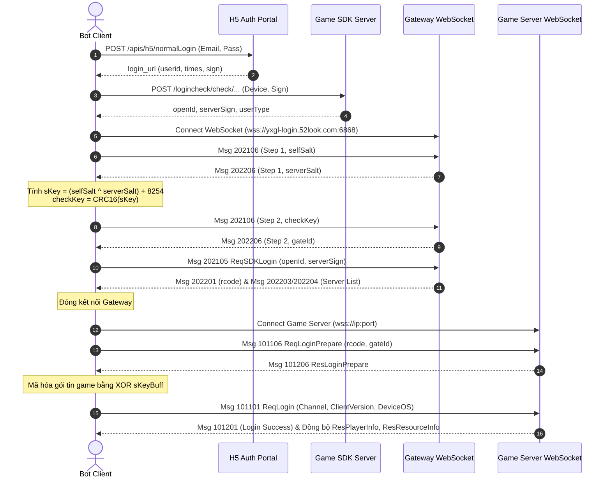

# 👑 HOÀNG HẬU CÁT TƯỜNG (H5) - AUTO BOT & PROTOCOL TOOLS

Dự án cung cấp bộ công cụ phân tích giao thức mạng, giải mã/đóng gói dữ liệu nhị phân (**Binary Protocol Buffers** qua WebSocket) và **Auto Bot chơi game tự động** toàn diện cho tựa game **Hoàng Hậu Cát Tường (52look H5)**.

---

## 📁 1. Cấu Trúc Dự Án Chuẩn (Modular Architecture)

Dự án được tái cấu trúc theo mô hình phân tầng (**Service-Oriented / Multi-tier Architecture**) giúp mã nguồn tách bạch, dễ quản lý, mở rộng và bảo trì:

```text
d:/UTE/hhgl/
├── src/
│   ├── config/             # Cấu hình hệ thống & từ điển game gốc
│   │   ├── constants.js    # Bảng PROP_NAMES, URL đăng nhập, phiên bản client
│   │   ├── item_names.json # Từ điển 323 tên vật phẩm chuẩn giải mã từ game
│   │   ├── main_tasks.json # Từ điển 688 nhiệm vụ chính tuyến & mục tiêu
│   │   └── index.js
│   ├── core/               # Tầng kỹ thuật cốt lõi (Core Engine)
│   │   ├── crypto.js       # CRC16Helper & EncryptHelper (Dynamic XOR Stream Cipher)
│   │   ├── protocol.js     # encodeMsg, decodeBuffer, formatAwards, formatPropName
│   │   ├── auth.js         # loginGame, authenticateSdk, getGatewayAuth
│   │   └── index.js
│   ├── services/           # Tầng nghiệp vụ Auto Game độc lập (Feature Services)
│   │   ├── BaseService.js  # Lớp cơ sở (kế thừa send, sleep, sleepRandom, playerData)
│   │   ├── WelfareService.js # Phúc lợi 5 Tab (Báo danh, Online, 7 Ngày, VIP, Cây Cầu Nguyện)
│   │   ├── MailService.js  # Quản lý Hộp Thư (Quét thư, nhận quà, dọn dẹp)
│   │   ├── WorkService.js  # Sắp Xếp Nội Vụ (Từ thiện, Vườn thuốc, Bổ khí) & Xử lý Sự Vụ
│   │   ├── StageService.js # Vượt ải cốt truyện PVE & Diệt Boss chương
├── domains/                # 🏛️ Phân hệ nghiệp vụ theo Domain-Driven Architecture
│   ├── base/               # Lớp cơ sở BaseService & hooks
│   ├── daily/              # Nội vụ, Hộp thư, Thiên lao
│   ├── welfare/            # Phúc lợi 5 Tab, Hoàng Cung, BXH, 7 Ngày, Thành tựu
│   ├── combat/             # Vượt ải PVE, Trảm Boss, Tủ đồ & So tài y phục
│   ├── growth/             # Thăng quan, Tùy tùng, Đan dược, Hậu cung, 688 Quests
│   └── leisure/            # Vườn hoa, Nông trại trang viên, Thư viện học viện
├── runners/                # 🚀 Lớp điều phối & giao diện CLI
│   ├── ServiceRegistry.js  # Dynamic Service Loader & WebSocket Packet Router
│   └── UI.js               # Render Menu tương tác CLI, Dashboard thông tin nhân vật
├── bot/                    # Tầng kết nối WebSocket & GameClient
│   └── GameClient.js       # Quản lý WebSocket Game, Heartbeat 10s, State Sync
├── proto/                  # Định nghĩa giao thức Protobuf
│   ├── proto.json          # Toàn bộ Protobuf Schema được biên dịch từ client game
│   └── protoId.json        # Bảng ánh xạ 2 chiều (MsgID <-> [Module, ClassName])
├── tools/                  # Công cụ tiện ích
│   ├── syncProto.js        # Engine tự động đồng bộ Protobuf từ CDN
│   └── downloadFullGameSource.js # Tải & giải mã Full JS + 467 Bảng DB game
├── package.json            # Cấu hình Node.js dependencies & scripts
└── README.md               # Tài liệu hướng dẫn & kỹ thuật chi tiết
```

---

## ⚙️ 2. Cài Đặt Môi Trường

1. **Yêu cầu hệ thống:** Đã cài đặt [Node.js](https://nodejs.org/) (khuyến nghị Node 18+).
2. **Cài đặt thư viện dependencies:**
   Mở terminal tại thư mục dự án và chạy:
   ```bash
   npm install
   ```

---

## 🚀 3. Hướng Dẫn Sử Dụng Auto Bot

### Cách 1: Cấu hình file .env (Khuyên dùng)
Tạo hoặc chỉnh sửa file `.env` (tham khảo `.env.example`):
```ini
GAME_EMAIL=your_email@gmail.com
GAME_PASSWORD=your_password
GAME_SERVER_ID=1105
GAME_ACTION=
```
Sau đó chỉ cần chạy:
```bash
npm start
```

### Cách 3: Triển khai Treo Máy 24/7 trên Render.com (Miễn Phí)
1. Đẩy code lên GitHub Repository cá nhân.
2. Truy cập [Render.com](https://render.com) -> Chọn **New** -> **Web Service**.
3. Chọn Repository GitHub của bạn.
4. Cấu hình các thông số:
   - **Name**: `hhgl-bot`
   - **Runtime**: `Node`
   - **Build Command**: `npm install`
   - **Start Command**: `npm start`
   - **Plan**: `Free`
5. Trong mục **Environment Variables**, thêm các biến:
   - `GAME_EMAIL`: Email tài khoản game của bạn
   - `GAME_PASSWORD`: Mật khẩu game
   - `GAME_SERVER_ID`: `1105` (hoặc ID server của bạn)
   - `GAME_ACTION`: `3.1` (tự động chạy chế độ Treo máy 24/7)
6. Bấm **Create Web Service**. Bot sẽ tự động chạy ngầm liên tục và phản hồi Healthcheck qua cổng HTTP!
*(Mẹo: Dùng [UptimeRobot](https://uptimerobot.com) ping URL của Render mỗi 5 phút để giữ bot luôn thức 24/7).*

---

## 🎮 4. Chi Tiết Các Tính Năng Tự Động

| Phím | Tác vụ | Chi tiết hoạt động |
|:---:|---|---|
| **`1`** | 🎁 **Phúc Lợi Hàng Ngày, Hộp Thư, 7 Ngày & Thành Tựu** | Tự động nhận trọn bộ 5 Tab Phúc Lợi (Báo danh, Online, Đăng nhập 7 ngày, VIP/Tích lũy, Cây Cầu Nguyện), quà hòm thư + dọn thư rác, toàn bộ nhiệm vụ 7 Ngày Vui Vẻ & toàn bộ mốc Thành Tựu Cung Đình đạt điều kiện. |
| **`2`** | 💼 **Sắp Xếp Nội Vụ & Xử Lý Cung Vụ** | Thu hoạch sạch lượt **Từ Thiện, Vườn Thuốc, Bổ Khí** và phê duyệt toàn bộ **Sự vụ Triều Đình** theo `workId` thật (100% ưu tiên nhận Cung Vận) một lần duy nhất. |
| **`3`** | 🎒 **Bồi Dưỡng Tùy Tùng & Thư Viện** | Mở túi đồ cắn đan dược, tự động đọc Thư Tùy Tùng (xóa dấu hoa hồng), nâng cấp tư chất & level Tùy tùng, đồng thời cử Tùy tùng đọc sách tại Thư Viện / Học Viện nhận EXP & Kỹ năng. |
| **`3.1`** | 🔄 **Auto 24/7 Vòng Lặp Nội Vụ, Cung Vụ & Tùy Tùng** | **Chế độ treo máy 24/7:** Tự động thu hoạch Nội Vụ & Cung Vụ, tự động bồi dưỡng Tùy Tùng (đề bạt & nâng cấp bằng Bạc), tính toán thời gian hồi phục tiếp theo của từng phân hệ, tự động đếm ngược và lặp lại liên tục không ngừng nghỉ. |
| **`4`** | ⚔️ **Vượt Ải Cốt Truyện** | Tự động xuất chiến đánh quái PVE liên tục và tự động khiêu chiến Boss chương với Tùy tùng phù hợp. Tự ngắt ngay khi hết lượt hoặc hết lính. |
| **`5`** | 👑 **Hoàng Cung & BXH** | Thỉnh an Hoàng Cung & Bái kiến 3 Bảng Xếp Hạng nhận Vàng & Bạc miễn phí. |
| **`6`** | 💕 **Vấn An Hậu Cung** | Kiểm tra danh sách Tri Kỷ thực tế, vấn an tăng EXP Tri kỷ và sinh hài nhi (tự nhận diện an toàn nếu chưa kết duyên Tri Kỷ). |
| **`7`** | 🌺 **Vườn Hoa & Thêu Hoa** | Thu hoạch bong bóng hoa, nhận thưởng tranh thêu & ghé thăm vườn hoa bạn bè để hái trộm hoa. |
| **`8`** | 🌾 **Trang Viên Nông Trại** | Gieo hạt giống & thu hoạch hoa màu nông sản 1-chạm. |
| **`9`** | 🏆 **Tự Động Giải & Nhận Nhiệm Vụ** | **Tự động giải và nhận trọn gói nhiệm vụ:** Phân tích `targetType` của nhiệm vụ chính tuyến hiện tại (trong 688 nhiệm vụ), tự động gửi gói tin tương ứng để hoàn thành yêu cầu $\rightarrow$ nhận thưởng $\rightarrow$ mở khóa nhiệm vụ tiếp theo, đồng thời tự động nhận toàn bộ **Nhiệm vụ Hàng Ngày, Rương Năng Động và Nhiệm vụ Tước Vị**! |
| **`10`** | 📊 **Xem Lại Thông Tin** | Hiển thị Dashboard tài nguyên thời gian thực: Cấp độ, Tước vị, Cung vận, Thế lực, Vàng, Bạc, Lương, Binh và Bảng thời gian hồi phục Cooldowns. |
| **`0`** | 🚪 **Thoát Game** | Ngắt kết nối WebSocket an toàn và đóng ứng dụng. |

---

## 🔬 5. Kiến Trúc Giao Thức Mạng & Bảo Mật (Technical Protocol)

### 1. Luồng Xác Thực (Authentication Flow)



### 2. Cấu Trúc Binary Frame Header

#### Gói tin Client gửi lên Game Server (Client -> Server): **Header 12 Bytes**
```text
+---------------------+---------------------+---------------------+-------------------------+
|  Total Length (4B)  |    Sequence (4B)    |   Message ID (4B)   |  Protobuf Payload (NB)  |
+---------------------+---------------------+---------------------+-------------------------+
|     Byte 0 .. 3     |     Byte 4 .. 7     |     Byte 8 .. 11    |   Byte 12 .. (TotalLen) |
+---------------------+---------------------+---------------------+-------------------------+
```

#### Gói tin Server phản hồi (Server -> Client): **Header 8 Bytes / Gói con**
*(Một frame WebSocket từ server có thể ghép nhiều gói con nối tiếp nhau)*
```text
+---------------------+---------------------+-------------------------------+
|  Content Length (4B)|   Message ID (4B)   |     Protobuf Payload (NB)     |
+---------------------+---------------------+-------------------------------+
|  offset + 0 .. 3    |  offset + 4 .. 7    | offset + 8 .. offset + 4 + Len|
+---------------------+---------------------+-------------------------------+
```

### 3. Thuật Toán Mã Hóa Payload Game (Dynamic XOR Stream Cipher)
Mọi gói tin Client gửi lên Game Server sau bước bắt tay (bắt đầu từ Msg `101101`) đều được mã hóa bằng mảng 4-key động sinh ra từ Gateway:
```javascript
// Sinh 4-byte key từ serverId và rcode
sKeyBuff[0] = (serverId + 138) & 0xFF;
sKeyBuff[1] = (sKeyBuff[0] ^ ((rcode >> 24) & 0xFF)) & 0xFF;
sKeyBuff[2] = (sKeyBuff[1] ^ ((rcode >> 16) & 0xFF)) & 0xFF;
sKeyBuff[3] = (sKeyBuff[2] ^ ((rcode >> 8) & 0xFF)) & 0xFF;

// Mã hóa payload từng byte bằng Sequence autoAddCode
const keyIndex = autoAddCode % 4;
const xorKey = (sKeyBuff[keyIndex] ^ 4617) & 0xFF;
for (let i = 0; i < payload.length; i++) {
  payload[i] ^= xorKey;
}
```

### 4. Từ Điển Dữ Liệu Game Gốc (Item & Quest Config Decryption)
Dữ liệu cấu hình của game được nén và mã hóa dưới dạng file nhị phân (`config.cfg`, `init.cfg`). Mỗi byte được giải mã qua phép toán:
```text
DecodedByte = RawByte ^ (4617 & 0xFF) = RawByte ^ 0x09
```
Dự án đã giải mã hoàn chỉnh và lưu trữ tại:
- [`src/config/item_names.json`](file:///d:/UTE/hhgl/src/config/item_names.json): **323 vật phẩm** chuẩn tiếng Việt trong game.
- [`src/config/main_tasks.json`](file:///d:/UTE/hhgl/src/config/main_tasks.json): **688 nhiệm vụ** chính tuyến kèm mục tiêu và mô tả chi tiết.

---

## 🛠️ 6. Hướng Dẫn Phát Triển & Thêm Tính Năng Mới (Extending Bot)

Nhờ kiến trúc domain module chuẩn, việc thêm một tính năng mới trong game rất trực quan và nhanh chóng:

### Bước 1: Tạo Service mới trong `src/domains/`
Tạo file kế thừa từ `BaseService` (ví dụ `src/domains/leisure/AllianceService.js`):
```javascript
const BaseService = require('../base/BaseService');

class AllianceService extends BaseService {
  constructor(client) {
    super(client, {
      id: 'alliance',
      domain: 'leisure',
      name: '[Bang Hội] Tự Động Bang Hội',
      menuOption: null,
      listenedMsgIds: [114202]
    });
  }

  async autoBuildAlliance() {
    console.log('[-] [Bang Hội] Đang tiến hành xây dựng bang...');
    // Gửi gói tin protobuf (ví dụ MsgID: 114102)
    this.send(114102, { buildType: 1 });
    await this.sleepRandom(1, 2);
  }
}

module.exports = AllianceService;
```

### Bước 2: Xuất Service trong `src/domains/index.js`
```javascript
const AllianceService = require('./leisure/AllianceService');

module.exports = {
  // ... các service khác
  AllianceService
};
```

### Bước 3: Đăng ký Service vào `GameClient` (`src/bot/GameClient.js`)
```javascript
const { AllianceService } = require('../domains');

// Trong constructor của GameClient:
this.alliance = new AllianceService(this);
```

### Bước 4: Thêm phím tắt vào Menu UI (`src/index.js`)
```javascript
case '11':
  await client.alliance.autoBuildAlliance();
  break;
```

---

## 📜 7. License & Disclaimer

- Dự án phục vụ mục đích nghiên cứu cấu trúc giao thức Protobuf và tối ưu hóa trải nghiệm tự động hóa cá nhân.
- Không sử dụng bot vào các mục đích phá hoại hoặc thương mại hóa trái phép.
